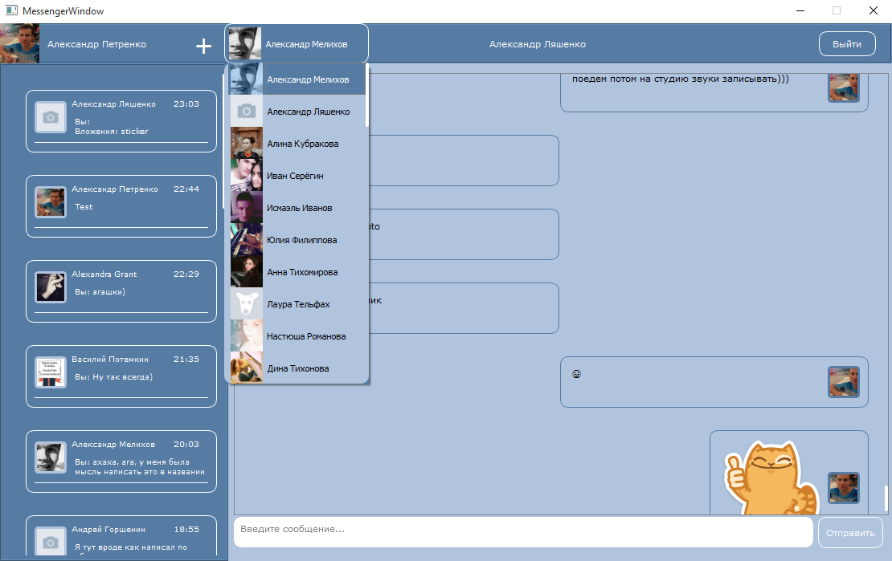

# VK Messenger

Мессенджер для социальной сети [Вконтакте](https://vk.com/). Проект разрабатывался в 2015 году, когда API сообщений было свободно и доступно. **С февраля 2019 года Вконтакте ввело [ограничение Messages API](https://vk.com/dev/messages_api), поэтому в данный момент мессенджер не будет работать без прохождения процедуры модерации ВК.**

Возможности:
* Авторизация с помощью логина и пароля;
* Получение текстовых сообщений
* Получение сообщений типа "Стикер"
* Отправка текстовых сообщений
*	Отображение списка друзей
*	Отображение списка диалогов;
*	Отображение списка сообщений диалога.

Взаимодействие с ВК осуществляется с помощью API v5.37 и v5.40. Данные возвращаются в формате JSON. Для авторизации используется механизм OAuth 2.0. Для получения входящих сообщений используется сервер Long Poll.

Проект написан на языке C++ с использованием Qt 5. Скомпилирован в Visual Studio 2013. Platform Toolset v120. Qt5.5. Дополнительно, для корректной работы QWebView с https потребуются библиотеки libeay32.dll и ssleay32.dll.

